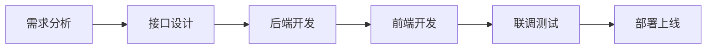

# 🧱 OpenChatAgent v3.0 开发指南

## 🚀 架构概述

OpenChatAgent v3.0 采用现代化的统一服务架构，专注于高性能和易维护性：

| 服务模块 | 端口 | 技术栈 | 说明 |
|---------|------|--------|------|
| **chat-api** | 8000 | Python FastAPI | 统一后端服务 |
| **chat-front** | 8001 | React + TypeScript | 用户聊天界面 |
| **chat-admin-ui** | 8006 | Ant Design Pro | 管理后台界面 |

### 🎯 核心特性

- 🤖 **AI 智能回复**: 基于阿里百炼 DashScope
- 👨‍💻 **人工接管**: 无缝 AI/人工切换
- 🔄 **实时通信**: WebSocket 流式对话
- 📊 **管理后台**: 完整的客服管理系统
- 🐳 **容器化**: Docker 支持，便于部署

## 📦 项目结构

```
OpenChatAgent/
├── chat-api/         # 🐍 Python 统一后端
│   ├── src/
│   │   ├── api/      # REST API 路由
│   │   ├── websocket/# WebSocket 处理
│   │   ├── ai/       # AI 服务模块
│   │   ├── session/  # 会话管理
│   │   ├── admin/    # 管理后台 API
│   │   └── models/   # 数据模型
│   └── requirements.txt
├── chat-front/       # ⚛️ React 用户界面
│   ├── src/
│   │   ├── components/
│   │   ├── hooks/
│   │   └── services/
│   └── package.json
├── chat-admin-ui/    # 🛠️ 管理后台
│   ├── src/
│   │   ├── pages/
│   │   ├── services/
│   │   └── components/
│   └── package.json
├── database/         # 📊 数据库脚本
├── docs/            # 📚 项目文档
└── scripts/         # 🔧 管理脚本
```

## 🛠️ 开发环境搭建

### 1. 环境要求

- **Python**: >= 3.11
- **Node.js**: >= 16.0.0
- **MySQL**: >= 8.0
- **Redis**: >= 6.0

### 2. 快速启动

```bash
# 1. 克隆项目
git clone <repository-url>
cd OpenChatAgent

# 2. 配置环境变量
cp .env.example .env
# 编辑 .env 文件，配置数据库和 API 密钥

# 3. 启动后端服务
cd chat-api
python -m venv venv
source venv/bin/activate  # Windows: venv\Scripts\activate
pip install -r requirements.txt
python run.py

# 4. 启动前端服务 (新终端)
cd chat-front
npm install
npm run dev

# 5. 启动管理后台 (新终端)
cd chat-admin-ui
npm install
npm run start:dev
```

### 3. 访问地址

- **用户聊天界面**: http://localhost:8001
- **管理后台**: http://localhost:8006
- **API 文档**: http://localhost:8000/docs

## 🔧 核心功能开发

### 1. chat-front (用户聊天界面)

**核心功能**:
- 实时聊天界面 (React + TypeScript)
- WebSocket 连接管理
- 消息流式显示
- AI/人工切换提示
- 满意度反馈

**关键文件**:
- `src/hooks/useChat.ts` - 聊天逻辑
- `src/hooks/useStreamingChat.ts` - 流式聊天
- `src/services/websocket.ts` - WebSocket 服务

**WebSocket 连接**:
```typescript
// 连接到统一后端
const wsUrl = 'ws://localhost:8000/ws';

// 消息格式
interface ChatMessage {
  type: 'text' | 'system' | 'init';
  content: string;
  sessionId?: string;
  userId?: string;
}
```

### 2. chat-api (统一后端服务)

**核心功能**:
- FastAPI 异步 Web 框架
- WebSocket 实时通信
- AI 服务集成 (阿里百炼)
- 会话管理 (Redis + MySQL)
- 管理后台 API

**关键模块**:

#### WebSocket 模块 (`src/websocket/`)
```python
# WebSocket 连接管理
class ConnectionManager:
    def __init__(self):
        self.active_connections: List[WebSocket] = []

    async def connect(self, websocket: WebSocket):
        await websocket.accept()
        self.active_connections.append(websocket)

    async def send_message(self, message: str, websocket: WebSocket):
        await websocket.send_text(message)
```

#### AI 服务模块 (`src/ai/`)
```python
# 阿里百炼集成
class DashScopeService:
    def __init__(self, api_key: str):
        self.api_key = api_key

    async def chat_completion(self, messages: List[dict]) -> str:
        # 调用阿里百炼 API
        pass
```

#### 会话管理模块 (`src/session/`)
```python
# 会话管理
class SessionManager:
    def __init__(self, redis_client, mysql_client):
        self.redis = redis_client
        self.mysql = mysql_client

    async def create_session(self, user_id: str) -> str:
        # 创建新会话
        pass

    async def get_session_history(self, session_id: str) -> List[dict]:
        # 获取会话历史
        pass
```

**API 端点**:
- `GET /health` - 健康检查
- `POST /api/v1/chat` - 聊天接口
- `GET /api/v1/sessions/{session_id}` - 获取会话
- `POST /api/v1/admin/login` - 管理员登录
- `WebSocket /ws` - WebSocket 连接

### 3. chat-admin-ui (管理后台)

**核心功能**:
- Ant Design Pro 管理界面
- 会话监控和管理
- 客服工作台
- 系统配置管理
- 数据统计分析

**关键页面**:
- `src/pages/Dashboard/` - 仪表板
- `src/pages/Conversations/` - 会话管理
- `src/pages/Settings/` - 系统设置

**API 集成**:
```typescript
// 管理后台 API 服务
export const adminApi = {
  // 获取会话列表
  getConversations: () => request('/api/v1/admin/conversations'),

  // 接管会话
  takeoverSession: (sessionId: string) =>
    request(`/api/v1/admin/sessions/${sessionId}/takeover`, {
      method: 'POST'
    }),

  // 获取统计数据
  getStatistics: () => request('/api/v1/admin/statistics')
};
```

## 🚀 快速开始

### 1. 环境准备

```bash
# 检查系统要求
python3 --version  # >= 3.11
node --version      # >= 16.0.0

# 检查数据库
mysql -h localhost -u root -p123456 -e "SELECT 1;"
redis-cli ping
```

### 2. 一键启动

```bash
# 克隆项目
git clone <repository-url>
cd OpenChatAgent

# 配置环境变量
cp .env.example .env
# 编辑 .env 文件，配置数据库和 API 密钥

# 启动所有服务
./start-dev.sh
```

### 3. 访问服务

- **用户聊天界面**: http://localhost:8001
- **管理后台界面**: http://localhost:8006
- **API 服务**: http://localhost:8000
- **API 文档**: http://localhost:8000/docs

## 🔧 开发工具

### 启动和停止

```bash
# 启动开发环境
./start-dev.sh

# 停止所有服务
./scripts/stop-dev.sh

# 强制清理进程
./scripts/kill-dev.sh

# 检查服务状态
./scripts/check-status.sh
```

### 单独启动服务

```bash
# 仅启动后端 API
cd chat-api
source venv/bin/activate
python run.py

# 仅启动用户前端
cd chat-front
npm run dev

# 仅启动管理后台
cd chat-admin-ui
npm run start:dev
```

## � 开发流程

### 1. 功能开发流程



### 2. 代码规范

**Python 后端**:
- 使用 `black` 格式化代码
- 使用 `flake8` 检查代码质量
- 使用 `mypy` 进行类型检查
- 遵循 PEP 8 规范

**TypeScript 前端**:
- 使用 `prettier` 格式化代码
- 使用 `eslint` 检查代码质量
- 严格的 TypeScript 类型检查
- 遵循 React 最佳实践

### 3. 测试策略

**单元测试**:
- 后端: `pytest` + `pytest-asyncio`
- 前端: `Jest` + `React Testing Library`

**集成测试**:
- API 接口测试
- WebSocket 连接测试
- 端到端功能测试

**性能测试**:
- 并发连接测试
- 响应时间测试
- 内存使用监控

## 🚀 部署指南

### 开发环境
```bash
# 使用 Docker Compose
docker-compose -f docker-compose.dev.yml up -d
```

### 生产环境
```bash
# 使用 Docker Compose
docker-compose -f docker-compose.prod.yml up -d
```

### 监控和日志
- 使用 `Prometheus` + `Grafana` 监控
- 使用 `ELK Stack` 日志收集
- 使用 `Sentry` 错误追踪

---

## 📚 相关文档

- [ARCHITECTURE_MIGRATION.md](./ARCHITECTURE_MIGRATION.md) - 架构迁移指南
- [API_REFERENCE.md](../chat-api/docs/API_REFERENCE.md) - API 参考文档
- [DEPLOYMENT.md](./DEPLOYMENT.md) - 部署指南
- [TROUBLESHOOTING.md](./TROUBLESHOOTING.md) - 故障排除

---

**更新日期**: 2025-06-16
**版本**: v3.0.0
