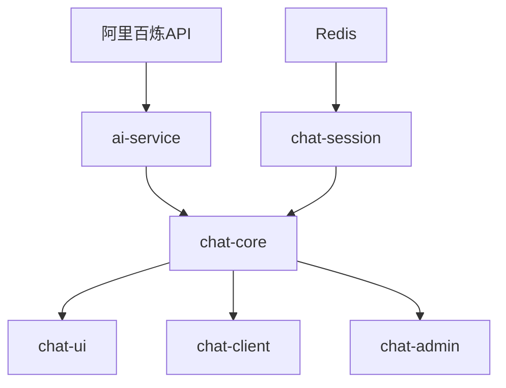

# 🚀 OpenChatAgent MVP 开发路线图

> **目标**：4 周内完成最小可行产品 (MVP)，实现 AI + 人工协同客服的核心功能

## 📅 总体时间规划

| 周次        | 主要任务     | 核心模块                                    | 里程碑       |
| ----------- | ------------ | ------------------------------------------- | ------------ |
| **第 1 周** | 后端基础设施 | `ai-service` + `chat-session` + `chat-core` | 后端服务可用 |
| **第 2 周** | 前端界面开发 | `chat-ui` + `chat-client`                   | 前后端联调   |
| **第 3 周** | 管理后台     | `chat-admin`                                | 完整功能演示 |
| **第 4 周** | 集成测试部署 | 全模块整合                                  | MVP 上线     |

---

## 🏗️ 第 1 周：后端基础设施搭建

### 🎯 目标

建立稳定的后端服务，支持 AI 对话和会话管理

### 📦 开发顺序 (并行开发)

#### Day 1-2: 基础模块初始化

- [ ] **ai-service**: 环境配置 + DashScope API 封装
- [ ] **chat-session**: Redis 连接 + 基础数据结构设计
- [ ] **chat-core**: Express 服务器 + WebSocket 基础框架

#### Day 3-4: 核心功能实现

- [ ] **ai-service**: 实现 `sendMessage()` 和上下文管理
- [ ] **chat-session**: 实现会话创建、状态管理、消息存储
- [ ] **chat-core**: 实现消息路由和 AI/人工切换逻辑

#### Day 5-7: 模块集成和测试

- [ ] **模块集成**: chat-core 集成 ai-service 和 chat-session
- [ ] **API 接口**: 完成 REST API 和 WebSocket 接口
- [ ] **单元测试**: 各模块核心功能测试
- [ ] **集成测试**: 端到端消息流程测试

### ✅ 第 1 周验收标准

- [ ] 能够通过 API 创建会话并发送消息
- [ ] AI 能够正确回复用户消息
- [ ] 支持 AI/人工状态切换
- [ ] WebSocket 连接稳定，消息实时推送
- [ ] Redis 中正确存储会话状态和历史

---

## 🎨 第 2 周：前端界面开发

### 🎯 目标

完成用户聊天界面和多端客户端，实现完整的用户体验

### 📦 开发顺序 (并行开发)

#### Day 1-2: 前端项目初始化

- [ ] **chat-ui**: React + Ant Design X 项目搭建
- [ ] **chat-client**: uniapp 项目初始化和多端配置
- [ ] **WebSocket 客户端**: 封装连接管理和消息处理

#### Day 3-5: 核心界面实现

- [ ] **chat-ui**: 聊天组件开发 (消息列表、输入框、状态栏)
- [ ] **chat-client**: 多端聊天页面适配
- [ ] **状态管理**: 实现 AI/人工状态显示和切换

#### Day 6-7: 前后端联调

- [ ] **接口对接**: 前端连接后端 WebSocket 和 REST API
- [ ] **功能测试**: 完整的聊天流程测试
- [ ] **UI 优化**: 界面美化和用户体验优化
- [ ] **多端测试**: H5 和小程序端功能验证

### ✅ 第 2 周验收标准

- [ ] 用户能够通过 Web 界面正常聊天
- [ ] AI 回复显示正确，状态切换正常
- [ ] H5 和小程序端基本功能可用
- [ ] 界面美观，交互流畅
- [ ] 支持断线重连和错误处理

---

## 👥 第 3 周：管理后台开发

### 🎯 目标

为客服人员提供会话管理和接管功能

### 📦 开发顺序

#### Day 1-2: 后台框架搭建

- [ ] **chat-admin**: ant-design-pro 项目初始化
- [ ] **认证系统**: 简单的登录和权限控制
- [ ] **基础布局**: 侧边栏导航和主内容区

#### Day 3-5: 核心管理功能

- [ ] **会话列表**: 显示所有活跃会话和状态
- [ ] **接管功能**: 实现会话接管和状态切换
- [ ] **消息查看**: 会话详情和历史消息展示
- [ ] **实时更新**: WebSocket 集成，实时消息推送

#### Day 6-7: 功能完善和测试

- [ ] **统计面板**: 基础数据统计和图表
- [ ] **客服工作台**: 客服状态管理和快速操作
- [ ] **整体测试**: 客服接管流程完整测试
- [ ] **界面优化**: 管理后台 UI/UX 优化

### ✅ 第 3 周验收标准

- [ ] 客服能够登录并查看所有会话
- [ ] 支持会话接管和 AI/人工切换
- [ ] 实时接收新消息并能够回复
- [ ] 基础统计数据正确显示
- [ ] 管理界面响应式且易用

---

## 🚀 第 4 周：集成测试和部署

### 🎯 目标

完成系统集成，部署上线，形成可演示的 MVP

### 📦 开发顺序

#### Day 1-2: 系统集成测试

- [ ] **端到端测试**: 完整业务流程测试
- [ ] **性能测试**: 并发连接和消息处理测试
- [ ] **兼容性测试**: 多浏览器和设备测试
- [ ] **错误处理**: 异常情况处理和恢复

#### Day 3-4: 部署准备

- [ ] **环境配置**: 生产环境配置和优化
- [ ] **Docker 化**: 容器化部署配置
- [ ] **监控日志**: 基础监控和日志收集
- [ ] **文档编写**: 部署文档和使用说明

#### Day 5-7: 上线和优化

- [ ] **生产部署**: 服务器部署和域名配置
- [ ] **功能验证**: 生产环境功能验证
- [ ] **性能优化**: 根据测试结果优化性能
- [ ] **用户测试**: 邀请用户测试并收集反馈

### ✅ 第 4 周验收标准

- [ ] 系统在生产环境稳定运行
- [ ] 所有核心功能正常工作
- [ ] 性能满足基本使用需求
- [ ] 具备基础的监控和日志
- [ ] 用户能够正常使用所有功能

---

## 🔄 模块依赖关系

## 📋 关键里程碑检查点

### 🔥 P0 - 必须完成 (MVP 核心)

- [ ] AI 自动回复功能
- [ ] 人工客服接管功能
- [ ] Web 端聊天界面
- [ ] 客服管理后台
- [ ] 基础会话管理

### 🟡 P1 - 重要功能 (增强体验)

- [ ] 小程序端支持
- [ ] 消息历史查询
- [ ] 基础统计面板
- [ ] 断线重连机制

### 🟢 P2 - 可选功能 (后续版本)

- [ ] 知识库管理
- [ ] 满意度评分
- [ ] 高级统计分析
- [ ] 多客服协同

## 🚨 风险控制

### 技术风险

- **阿里百炼 API 限制**: 准备备用方案或本地模型
- **Redis 性能瓶颈**: 优化数据结构和查询
- **WebSocket 连接稳定性**: 实现重连和降级机制

### 时间风险

- **功能范围控制**: 严格按照 P0 优先级开发
- **并行开发协调**: 定义清晰的接口规范
- **测试时间预留**: 每周预留 1-2 天测试时间

### 质量风险

- **代码质量**: 代码审查和单元测试
- **用户体验**: 及时收集反馈并优化
- **系统稳定性**: 充分的集成测试和压力测试

---

## 📈 成功指标

### 功能指标

- [ ] 用户能够正常发起对话并获得 AI 回复
- [ ] 客服能够成功接管会话并与用户对话
- [ ] 系统支持至少 100 个并发会话
- [ ] 消息响应时间 < 2 秒

### 质量指标

- [ ] 系统可用性 > 99%
- [ ] 消息送达率 > 99.9%
- [ ] 用户界面响应时间 < 1 秒
- [ ] 零严重安全漏洞

### 用户体验指标

- [ ] 用户能够在 30 秒内学会使用
- [ ] 客服能够在 5 分钟内掌握管理后台
- [ ] 移动端界面适配良好
- [ ] 支持主流浏览器和设备
