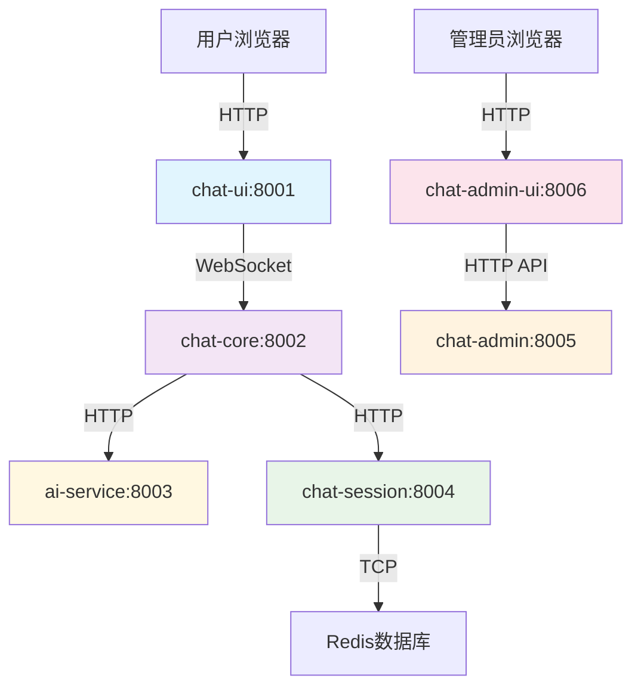

# 🔧 OpenChatAgent 端口配置统一化

## 📋 端口分配总览

为了便于管理和记忆，所有服务统一使用 **800x** 端口系列：

| 端口 | 服务模块          | 说明                          | 访问地址              |
| ---- | ----------------- | ----------------------------- | --------------------- |
| 8001 | **chat-ui**       | 用户前端聊天界面              | http://localhost:8001 |
| 8002 | **chat-core**     | 消息网关 + WebSocket 服务     | http://localhost:8002 |
| 8003 | **ai-service**    | AI 服务 (阿里百炼 API)        | http://localhost:8003 |
| 8004 | **chat-session**  | 会话管理服务 (Redis)          | http://localhost:8004 |
| 8005 | **chat-admin**    | 管理后台 API                  | http://localhost:8005 |
| 8006 | **chat-admin-ui** | 管理后台前端 (Ant Design Pro) | http://localhost:8006 |

## 🔄 服务间调用关系



## ⚙️ 环境变量配置

```bash
# .env 文件配置
CHAT_UI_PORT=8001
CHAT_CORE_PORT=8002
AI_SERVICE_PORT=8003
CHAT_SESSION_PORT=8004
CHAT_ADMIN_PORT=8005
CHAT_ADMIN_UI_PORT=8006
```

## 🚀 启动服务

### 单独启动

```bash
# 用户前端
cd chat-ui && npm run dev          # http://localhost:8001

# 消息网关
cd chat-core && npm run dev        # http://localhost:8002

# AI服务
cd ai-service && npm run dev       # http://localhost:8003

# 会话管理
cd chat-session && npm run dev     # http://localhost:8004

# 管理后台API
cd chat-admin && npm run dev       # http://localhost:8005

# 管理后台前端
cd chat-admin-ui && npm run start:dev  # http://localhost:8006
```

### 一键启动

```bash
# 启动所有服务 (自动同步环境配置)
npm run dev

# 或使用便捷脚本
./start-dev.sh

# 手动同步环境配置
npm run env:sync
```

## 🔍 健康检查

```bash
# 检查所有服务状态
curl -s http://localhost:8001 && echo "✅ chat-ui"
curl -s http://localhost:8002/api/health && echo "✅ chat-core"
curl -s http://localhost:8003/health && echo "✅ ai-service"
curl -s http://localhost:8004/health && echo "✅ chat-session"
curl -s http://localhost:8005/health && echo "✅ chat-admin"
curl -s http://localhost:8006 && echo "✅ chat-admin-ui"
```

## 🛠️ 端口冲突解决

```bash
# 查看端口占用
lsof -i :8001,8002,8003,8004,8005,8006

# 强制清理所有进程
pkill -f "node\|npm\|max\|umi"
```

## 📝 更新记录

- **v2.0.0 (2025-01-17)**: 端口统一化为 800x 系列
  - chat-ui: 5173 → 8001
  - chat-core: 3001 → 8002
  - ai-service: 3002 → 8003
  - chat-session: 3003 → 8004
  - chat-admin: 3004 → 8005
  - chat-admin-ui: 新增 8006

---

**优势**：

- ✅ 端口号连续，便于记忆
- ✅ 避免与其他服务端口冲突
- ✅ 统一的 800x 命名规范
- ✅ 更专业的端口管理
