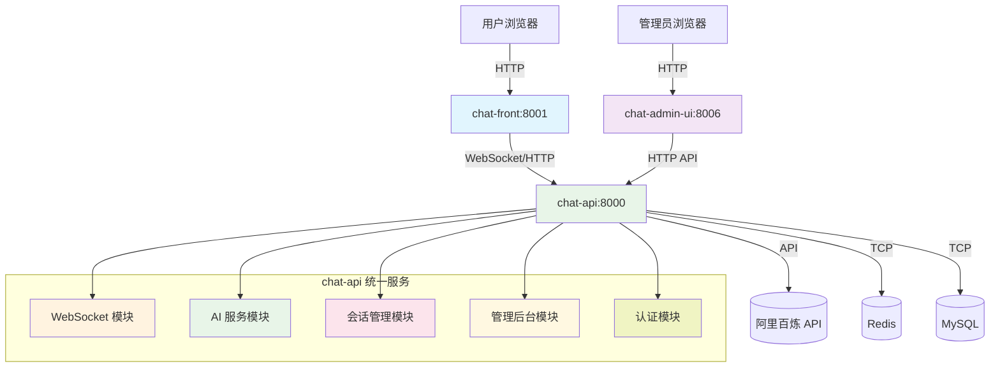

# 🔧 OpenChatAgent 端口配置统一化

## 📋 端口分配总览 (更新后)

**🚀 架构简化**: 原有的4个 Node.js 微服务已整合为1个 Python 统一服务

| 端口 | 服务模块          | 说明                          | 访问地址              | 状态 |
| ---- | ----------------- | ----------------------------- | --------------------- | ---- |
| 8000 | **chat-api**      | 统一后端服务 (Python FastAPI) | http://localhost:8000 | ✅ 活跃 |
| 8001 | **chat-front**    | 用户前端聊天界面 (React)       | http://localhost:8001 | ✅ 活跃 |
| 8006 | **chat-admin-ui** | 管理后台前端 (Ant Design Pro) | http://localhost:8006 | ✅ 活跃 |

## 🗑️ 已删除的旧服务

| 端口 | 旧服务模块        | 整合到                        | 状态 |
| ---- | ----------------- | ----------------------------- | ---- |
| 8002 | ~~chat-core~~     | chat-api/src/websocket/       | ❌ 已删除 |
| 8003 | ~~ai-service~~    | chat-api/src/ai/              | ❌ 已删除 |
| 8004 | ~~chat-session~~  | chat-api/src/session/         | ❌ 已删除 |
| 8005 | ~~chat-admin~~    | chat-api/src/admin/           | ❌ 已删除 |

## 🔄 新架构服务调用关系



## ⚙️ 环境变量配置

```bash
# .env 文件配置 (更新后)
CHAT_API_PORT=8000
CHAT_FRONT_PORT=8001
CHAT_ADMIN_UI_PORT=8006

# 前端环境变量
VITE_CHAT_API_WS_URL=ws://localhost:8000/ws
VITE_CHAT_API_URL=http://localhost:8000/api/v1
REACT_APP_API_BASE_URL=http://localhost:8000/api/v1
```

## 🚀 启动服务 (更新后)

### 单独启动

```bash
# 统一后端服务 (Python FastAPI)
cd chat-api && python run.py       # http://localhost:8000

# 用户前端 (React)
cd chat-front && npm run dev       # http://localhost:8001

# 管理后台前端 (Ant Design Pro)
cd chat-admin-ui && npm run start:dev  # http://localhost:8006
```

### 一键启动

```bash
# 启动所有服务
./start-dev.sh

# 或分别启动
npm run dev:api     # 启动 chat-api
npm run dev:front   # 启动 chat-front
npm run dev:admin   # 启动 chat-admin-ui
```

## 🔍 健康检查 (更新后)

```bash
# 检查所有服务状态
curl -s http://localhost:8000/health && echo "✅ chat-api"
curl -s http://localhost:8001 && echo "✅ chat-front"
curl -s http://localhost:8006 && echo "✅ chat-admin-ui"

# 检查 API 文档
curl -s http://localhost:8000/docs && echo "✅ API 文档可访问"
```

## 🛠️ 端口冲突解决

```bash
# 查看端口占用
lsof -i :8000,8001,8006

# 强制清理进程
pkill -f "python\|node\|npm\|max\|umi"

# 清理 Python 进程
pkill -f "uvicorn\|fastapi"
```

## 📝 更新记录

- **v3.0.0 (2025-06-16)**: 架构重构 - 微服务整合
  - ✅ 删除 4 个 Node.js 微服务
  - ✅ 整合为 1 个 Python 统一服务 (chat-api:8000)
  - ✅ 保留前端服务 (chat-front:8001, chat-admin-ui:8006)
  - ✅ 更新所有接口调用配置

- **v2.0.0 (2025-01-17)**: 端口统一化为 800x 系列
  - chat-ui: 5173 → 8001
  - chat-core: 3001 → 8002
  - ai-service: 3002 → 8003
  - chat-session: 3003 → 8004
  - chat-admin: 3004 → 8005
  - chat-admin-ui: 新增 8006

---

**新架构优势**：

- ✅ 服务数量从 6 个减少到 3 个
- ✅ 统一的 Python 后端，便于维护
- ✅ 减少服务间通信复杂度
- ✅ 更好的性能和资源利用率
- ✅ 简化的部署和监控
