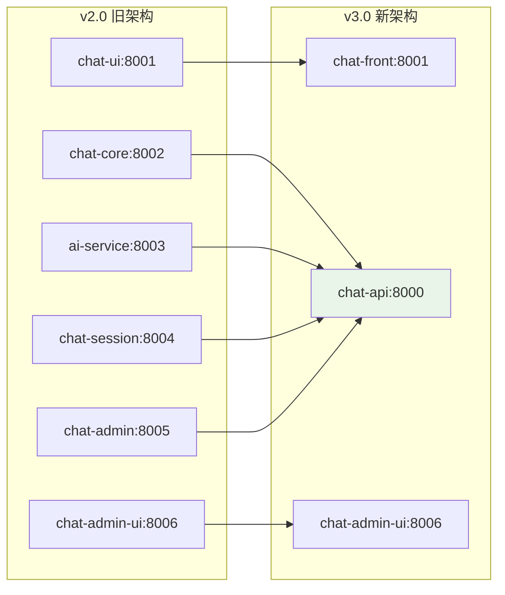

# OpenChatAgent (开放聊天智能客服)

**OpenChatAgent** 是一个开源的智能客服系统，它结合了 AI 聊天机器人功能与人工坐席回退机制。该系统支持多渠道接入（网页、微信、小程序），默认由 AI 应答，并允许人工客服随时接管。

> 🚀 **v3.0 重大更新**: 已完成微服务整合，从 6 个服务简化为 3 个服务，大幅提升性能和维护性！

## ✨ 产品特性

- 🤖 **AI 优先回复**: 基于阿里百炼 DashScope (通义千问)
- 👨‍💻 **人工坐席接管**: 支持 AI/人工无缝切换
- 🔄 **实时通信**: WebSocket 支持流式对话
- 📱 **多平台支持**: Web / H5 / 小程序 / 微信
- 💬 **现代化 UI**: React + Ant Design 聊天界面
- 🛠️ **管理后台**: 完整的客服管理系统
- ⚙️ **会话管理**: Redis 缓存 + MySQL 持久化
- 🐳 **容器化部署**: Docker 支持，便于部署

## 📦 技术栈 (v3.0)

### 🐍 后端 (统一服务)
- **chat-api**: Python + FastAPI + WebSocket
- **数据库**: MySQL + Redis
- **AI 引擎**: 阿里百炼 DashScope API

### ⚛️ 前端
- **chat-front**: React + TypeScript + Vite (用户界面)
- **chat-admin**: Vue 3 + Element Plus + TypeScript (管理后台) ⭐ 全新重构

### 🔄 架构升级
- ✅ **微服务整合**: 4个Node.js服务 → 1个Python服务
- ✅ **性能提升**: 减少服务间通信开销
- ✅ **维护简化**: 统一技术栈，降低复杂度
- ✅ **管理后台重构**: React + Ant Design Pro → Vue 3 + Element Plus ⭐ 新增

## 🚀 快速开始

### 🔧 环境要求

- **Python**: >= 3.11 (后端服务)
- **Node.js**: >= 16.0.0 (前端构建)
- **数据库**: MySQL + Redis
- **系统**: macOS / Linux / Windows

### ⚡ 一键启动

**方式 1: 使用启动脚本（推荐）**

```bash
# macOS/Linux
./start-dev.sh

# Windows
start-dev.bat
```

**方式 2: 分步启动**

```bash
# 1. 配置环境变量
cp .env.example .env
# 编辑 .env 文件，设置数据库和 API 密钥

# 2. 启动后端服务
cd chat-api
python -m venv venv
source venv/bin/activate  # Windows: venv\Scripts\activate
pip install -r requirements.txt
python run.py

# 3. 启动前端服务 (新终端)
cd chat-front
npm install
npm run dev

# 4. 启动管理后台 (新终端)
cd chat-admin
pnpm install  # 或 npm install
pnpm dev      # 或 npm run dev
```

### 🌐 访问地址

- 🖥️ **用户聊天界面**: http://localhost:8001
- 🛠️ **管理后台界面**: http://localhost:4001 ⭐ 新端口
- 🔗 **API 服务**: http://localhost:8000
- 📚 **API 文档**: http://localhost:8000/docs

### ⚙️ 环境配置

核心配置项（.env 文件）：

```bash
# 服务端口配置
CHAT_API_PORT=8000
CHAT_FRONT_PORT=8001
CHAT_ADMIN_PORT=4001  # 新的管理后台端口

# 数据库配置
MYSQL_HOST=localhost
MYSQL_PORT=3306
MYSQL_USER=root
MYSQL_PASSWORD=123456
MYSQL_DATABASE=openchatagent

REDIS_HOST=localhost
REDIS_PORT=6379

# AI 服务配置（必须）
DASHSCOPE_API_KEY=sk-your_api_key_here
DASHSCOPE_MODEL=qwen-turbo

# 管理员账户
ADMIN_USERNAME=admin
ADMIN_PASSWORD=admin123
```

## 📁 项目结构 (v3.0)

```
OpenChatAgent/
├── chat-api/         # 🐍 Python 统一后端服务 (FastAPI)
│   ├── src/
│   │   ├── api/      # REST API 路由
│   │   ├── websocket/# WebSocket 处理
│   │   ├── ai/       # AI 服务模块
│   │   ├── session/  # 会话管理
│   │   ├── admin/    # 管理后台 API
│   │   └── models/   # 数据模型
│   └── requirements.txt
├── chat-front/       # ⚛️ React 用户聊天界面
│   ├── src/
│   │   ├── components/
│   │   ├── hooks/
│   │   └── services/
│   └── package.json
├── chat-admin/       # 🛠️ Vue 3 + Element Plus 管理后台 ⭐ 全新重构
│   ├── src/
│   │   ├── views/
│   │   ├── api/
│   │   ├── components/
│   │   └── store/
│   └── package.json
├── database/         # 📊 数据库脚本
├── docs/            # 📚 项目文档
├── scripts/         # 🔧 管理脚本
├── .env.example     # 🔧 环境变量模板
└── README.md        # 📖 项目说明
```

## 📋 可用命令

```bash
# 开发环境
./start-dev.sh        # 一键启动所有服务
npm run dev:api       # 仅启动后端 API
npm run dev:front     # 仅启动用户前端
npm run dev:admin     # 仅启动管理后台

# 生产环境
docker-compose up     # Docker 容器化部署
```

## 🏗️ 系统架构 (v3.0)

### 📊 服务对比

| 项目 | v2.0 (旧架构) | v3.0 (新架构) | 改进 |
|------|---------------|---------------|------|
| **服务数量** | 6个微服务 | 3个服务 | ✅ 简化50% |
| **后端技术** | Node.js | Python FastAPI | ✅ 性能提升 |
| **部署复杂度** | 高 | 低 | ✅ 运维简化 |
| **开发效率** | 中等 | 高 | ✅ 统一技术栈 |

### 🔄 架构演进



## 📅 路线图

### ✅ 已完成 (v3.0)
- [x] **架构重构**: 微服务整合
- [x] **AI 自动回复**: 阿里百炼集成
- [x] **人工坐席接管**: AI/人工切换
- [x] **实时通信**: WebSocket 支持
- [x] **管理后台**: 完整的管理界面
- [x] **统一配置**: 环境变量管理

### 🚧 开发中
- [ ] **Docker 部署**: 容器化支持
- [ ] **API 文档**: OpenAPI 规范
- [ ] **监控系统**: 性能监控面板
- [ ] **插件系统**: 扩展功能支持

### 🔮 计划中
- [ ] **多租户**: SaaS 模式支持
- [ ] **移动端**: 小程序/APP 适配
- [ ] **国际化**: 多语言支持
- [ ] **高可用**: 集群部署方案

## 📜 开源许可

MIT License

> 🤝 欢迎贡献！感谢提交 PR 和 Issue。

## 📝 开发指南

详细的开发文档请参考：

- [PORT_CONFIGURATION.md](./PORT_CONFIGURATION.md) - 端口配置说明
- [chat-api/README.md](./chat-api/README.md) - 后端 API 文档
- [chat-front/README.md](./chat-front/README.md) - 前端开发指南
- [chat-admin/README.md](./chat-admin/README.md) - 管理后台指南 ⭐ 全新重构
- [docs/chat-admin-migration.md](./docs/chat-admin-migration.md) - 管理后台重构文档

## 🔧 故障排除

### 端口冲突

```bash
# 查看端口占用
lsof -i :8000,8001,8006

# 强制清理进程
pkill -f "python\|node\|npm"
```

### 数据库连接问题

```bash
# 检查 MySQL 连接
mysql -h localhost -u root -p123456 -e "SHOW DATABASES;"

# 检查 Redis 连接
redis-cli ping
```

### API 服务问题

```bash
# 检查 chat-api 健康状态
curl http://localhost:8000/health

# 查看 API 文档
open http://localhost:8000/docs
```

## 🎯 生产部署

### Docker 部署（推荐）

```bash
# 构建和启动所有服务
docker-compose up -d

# 查看服务状态
docker-compose ps

# 查看日志
docker-compose logs -f
```

### 手动部署

```bash
# 1. 部署后端服务
cd chat-api
python -m venv venv
source venv/bin/activate
pip install -r requirements.txt
gunicorn -w 4 -k uvicorn.workers.UvicornWorker src.main:app

# 2. 构建前端
cd chat-front
npm run build
# 部署 dist/ 目录到 Web 服务器

cd chat-admin
pnpm build  # 或 npm run build
# 部署 dist/ 目录到 Web 服务器
```

### 环境配置

生产环境需要配置以下环境变量：

```bash
# 生产环境配置
NODE_ENV=production
DEBUG_MODE=false

# 数据库配置
MYSQL_HOST=your-mysql-host
MYSQL_PASSWORD=your-secure-password
REDIS_HOST=your-redis-host

# API 密钥
DASHSCOPE_API_KEY=your-production-api-key
JWT_SECRET=your-super-secure-jwt-secret
```

---

## 🚀 核心优势

- ✅ **架构简化**: 从6个服务减少到3个服务
- ✅ **性能提升**: Python FastAPI 高性能异步框架
- ✅ **开发效率**: 统一技术栈，降低学习成本
- ✅ **部署简单**: 容器化支持，一键部署
- ✅ **维护便捷**: 减少服务间通信复杂度
- ✅ **扩展性强**: 模块化设计，易于功能扩展
