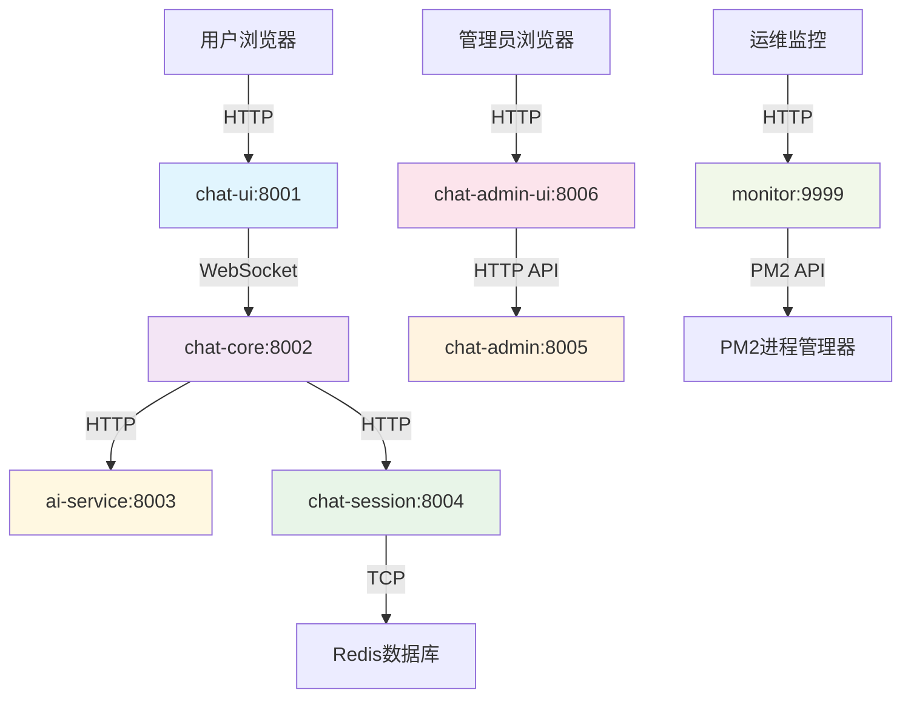

# OpenChatAgent (开放聊天智能客服)

**OpenChatAgent** 是一个开源的智能客服系统，它结合了 AI 聊天机器人功能与人工坐席回退机制。该系统支持多渠道接入（网页、微信、小程序），默认由 AI 应答，并允许人工客服随时接管。

> 💡 目前正在积极开发中 — MVP 版本仅关注核心功能。

## ✨ 产品特性

- 🤖 AI 优先自动回复，基于阿里百炼 DashScope (通义千问 MCP)
- 👨‍💻 人工坐席可随时加入/离开会话，暂停/恢复 AI 服务
- 🔄 支持通过前端按钮或 Webhook 进行坐席切换
- 📱 多平台入口：Web / H5 / 小程序 / 微信
- 💬 内置聊天 UI，基于 Ant Design X
- 📡 WebSocket + REST API 后端
- ⚙️ 基于 Redis 的会话和上下文管理

## 📦 技术栈

- 前端：React + Ant Design X
- 后端：Node.js + WebSocket + Redis
- AI 引擎：阿里百炼 DashScope API
- 移动客户端：uniapp (可选)
- 可选的管理后台：Chatwoot 或 ant-design-pro

## 🚀 快速开始

### 🔧 环境要求

- Node.js >= 16.0.0
- npm >= 8.0.0
- Redis (用于会话管理)

### ⚡ 一键启动

**方式 1: 使用脚本（推荐）**

```bash
# macOS/Linux
./start-dev.sh

# Windows
start-dev.bat
```

**方式 2: 使用命令行工具**

```bash
# 安装依赖
npm install

# 交互式管理界面
npm run cli

# 直接启动开发模式
npm run dev

# 启动单个服务
npm run cli dev -s chat-ui
```

**方式 3: 手动启动**

```bash
# 1. 安装所有依赖
npm run install:all

# 2. 配置环境变量
cp .env.example .env
# 编辑 .env 文件，设置 DASHSCOPE_API_KEY 等配置

# 3. 生成各模块环境文件
npm run env:setup

# 4. 启动所有服务
npm run dev
```

### 🌐 访问地址

- 🖥️ **用户前端**: http://localhost:8001
- 🔗 **API 网关**: http://localhost:8002
- 🤖 **AI 服务**: http://localhost:8003
- 💾 **会话服务**: http://localhost:8004
- 🛠️ **管理后台**: http://localhost:8006 (API: http://localhost:8005)

### ⚙️ 环境配置

核心配置项（.env 文件）：

```bash
# 端口配置 (800x 系列统一管理)
CHAT_UI_PORT=8001
CHAT_CORE_PORT=8002
AI_SERVICE_PORT=8003
CHAT_SESSION_PORT=8004
CHAT_ADMIN_PORT=8005
CHAT_ADMIN_UI_PORT=8006

# 阿里百炼API密钥（必须）
DASHSCOPE_API_KEY=sk-your_api_key_here

# Redis连接
REDIS_HOST=localhost
REDIS_PORT=6379
```

## 📁 项目结构

```
OpenChatAgent/
├── chat-ui/          # React前端聊天界面
├── chat-core/        # Node.js消息网关服务
├── ai-service/       # 阿里百炼API封装
├── chat-session/     # Redis会话管理
├── scripts/          # 管理脚本
├── .env.example      # 环境变量模板
├── package.json      # 根项目配置
├── start-dev.sh      # Linux/macOS启动脚本
└── start-dev.bat     # Windows启动脚本
```

## 📋 可用命令

```bash
npm run dev           # 启动所有服务（开发模式）
npm run start         # 启动所有服务（生产模式）
npm run cli           # 交互式管理界面
npm run install:all   # 安装所有依赖
npm run env:setup     # 设置环境变量
npm run clean         # 清理项目文件
npm run test          # 运行所有测试
```

## 📅 路线图

- [x] AI 自动回复
- [x] 人工坐席接管
- [x] 统一环境配置管理
- [x] 一键启动开发环境
- [ ] 聊天历史界面
- [ ] 管理面板
- [ ] 插件支持（物流、订单查询等）
- [ ] Docker 部署支持
- [ ] OpenAPI 及部署文档

## 📜 开源许可

MIT

> 欢迎贡献！感谢提交 PR 和 Issue。

### 方式二：PM2 进程管理（推荐）⭐

```bash
# 使用PM2管理所有服务（推荐生产环境）
./start-pm2.sh

# PM2常用命令
pm2 status          # 查看服务状态
pm2 logs            # 查看所有日志
pm2 monit           # 终端监控界面
pm2 restart all     # 重启所有服务
pm2 stop all        # 停止所有服务
```

### 方式三：可视化监控面板 🎯

```bash
# 启动Web监控面板 (端口9999)
npm run monitor

# 访问监控面板
open http://localhost:9999
```

**监控面板功能**：

- 📊 实时服务状态监控
- 🔧 一键启停服务控制
- 📝 在线日志查看
- 💾 内存和 CPU 使用率
- 🚨 服务健康检查

## 🏗️ 系统架构

### 端口分配（800x 系列）

| 端口 | 服务模块          | 说明                          | 访问地址              |
| ---- | ----------------- | ----------------------------- | --------------------- |
| 8001 | **chat-ui**       | 用户前端聊天界面              | http://localhost:8001 |
| 8002 | **chat-core**     | 消息网关 + WebSocket 服务     | http://localhost:8002 |
| 8003 | **ai-service**    | AI 服务 (阿里百炼 API)        | http://localhost:8003 |
| 8004 | **chat-session**  | 会话管理服务 (Redis)          | http://localhost:8004 |
| 8005 | **chat-admin**    | 管理后台 API                  | http://localhost:8005 |
| 8006 | **chat-admin-ui** | 管理后台前端 (Ant Design Pro) | http://localhost:8006 |
| 9999 | **monitor**       | 可视化监控面板                | http://localhost:9999 |

### 服务间调用关系



## 📊 进程管理

### PM2 生态系统配置

- **自动重启**：进程崩溃时自动重启
- **内存限制**：防止内存泄漏，超限自动重启
- **日志管理**：统一日志收集和轮转
- **负载均衡**：支持集群模式（生产环境）
- **零宕机部署**：热重载和优雅重启

### 监控特性

- **实时状态**：CPU、内存、重启次数
- **健康检查**：端口连通性检测
- **日志查看**：Web 界面查看服务日志
- **一键操作**：重启、停止、启动服务

## 🛠️ 环境配置

系统提供统一的环境配置管理：

```bash
# 手动同步环境配置到各子项目
npm run env:sync
```

所有配置在根目录 `.env` 文件中统一管理，自动分发到各子项目。

## 📝 开发指南

详细的开发文档请参考：

- [PORT_CONFIGURATION.md](./PORT_CONFIGURATION.md) - 端口配置说明
- [docs/USAGE.md](./docs/USAGE.md) - 使用指南
- [docs/DEVELOP_GUIDE.md](./docs/DEVELOP_GUIDE.md) - 开发指南

## 🔧 故障排除

### 端口冲突

```bash
# 查看端口占用
lsof -i :8001,8002,8003,8004,8005,8006,9999

# 强制清理进程
./scripts/kill-dev.sh
```

### PM2 问题

```bash
# 重置PM2
pm2 kill
pm2 start ecosystem.config.js

# 查看PM2日志
pm2 logs [service-name]
```

### 监控面板异常

```bash
# 重启监控服务
npm run monitor

# 检查PM2状态
pm2 status
```

## 🎯 生产部署

生产环境推荐使用 PM2 进行进程管理：

1. **安装 PM2**: `npm install -g pm2`
2. **配置文件**: 使用 `ecosystem.config.js`
3. **启动服务**: `pm2 start ecosystem.config.js --env production`
4. **设置开机启动**: `pm2 startup && pm2 save`
5. **监控**: 访问 PM2+ 或自建监控面板

---

**核心优势**：

- ✅ **统一管理**：800x 端口系列 + PM2 进程管理
- ✅ **可视化监控**：Web 监控面板 + PM2 终端界面
- ✅ **高可用性**：自动重启 + 健康检查
- ✅ **开发友好**：一键启动 + 热重载
- ✅ **生产就绪**：零宕机部署 + 集群支持
