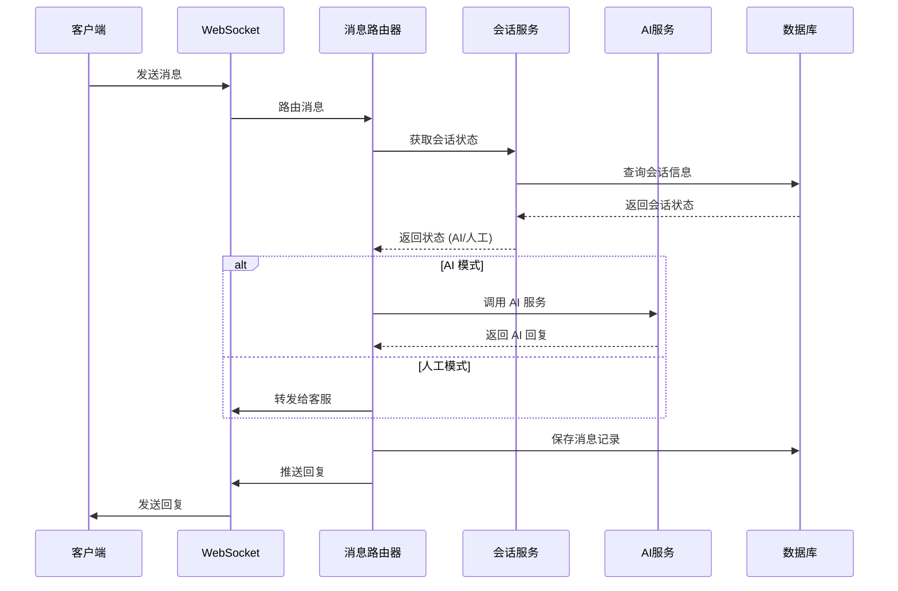
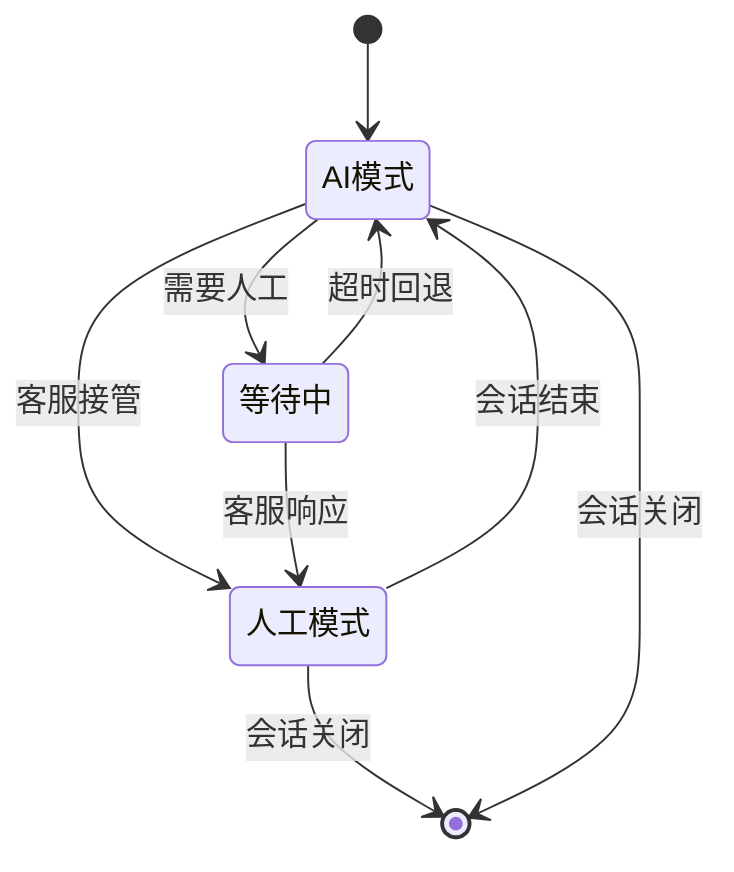

# 🏗️ Chat API 架构设计文档

## 📋 目录
- [系统架构](#系统架构)
- [技术栈](#技术栈)
- [模块设计](#模块设计)
- [数据流设计](#数据流设计)
- [安全架构](#安全架构)
- [性能设计](#性能设计)

## 🏛️ 系统架构

### 🔄 整体架构图
```
┌─────────────────────────────────────────────────────────────┐
│                    Chat API 统一服务                          │
├─────────────────────────────────────────────────────────────┤
│  🌐 API Gateway (FastAPI)                                   │
│  ├── 🔒 认证中间件 (JWT)                                      │
│  ├── 📊 日志中间件 (Logging)                                  │
│  ├── 🛡️ 安全中间件 (CORS, Rate Limit)                        │
│  └── 📈 监控中间件 (Metrics)                                  │
├─────────────────────────────────────────────────────────────┤
│  📡 WebSocket 服务层                                         │
│  ├── 🔌 连接管理器 (ConnectionManager)                        │
│  ├── 📨 消息路由器 (MessageRouter)                           │
│  ├── 🔄 状态同步器 (StateSync)                               │
│  └── 📢 广播服务 (BroadcastService)                          │
├─────────────────────────────────────────────────────────────┤
│  🧠 业务服务层                                               │
│  ├── 🤖 AI 服务 (AIService)                                 │
│  ├── 💾 会话服务 (SessionService)                            │
│  ├── 👥 用户服务 (UserService)                               │
│  ├── 💬 对话服务 (ConversationService)                       │
│  └── 📊 统计服务 (AnalyticsService)                          │
├─────────────────────────────────────────────────────────────┤
│  💾 数据访问层                                               │
│  ├── 🗄️ MySQL 仓储 (Repository Pattern)                     │
│  ├── 🔴 Redis 缓存 (Cache Layer)                            │
│  ├── 📝 日志存储 (Log Storage)                               │
│  └── 📁 文件存储 (File Storage)                              │
└─────────────────────────────────────────────────────────────┘
```

### 🔧 服务整合映射

| 原服务 | 端口 | 新模块 | 功能描述 |
|--------|------|--------|----------|
| chat-core | 8001 | `websocket/` | WebSocket 消息网关 |
| ai-service | 8003 | `ai/` | AI 服务封装 |
| chat-session | 8004 | `session/` | 会话管理 |
| chat-admin | 8005 | `admin/` | 管理后台 |

## 🛠️ 技术栈

### 🐍 核心技术
- **Python**: 3.11+
- **FastAPI**: 现代高性能 Web 框架
- **WebSockets**: 实时通信
- **asyncio**: 异步编程
- **Pydantic**: 数据验证和序列化

### 💾 数据存储
- **MySQL**: 主数据库 (用户、对话、消息)
- **Redis**: 缓存和会话存储
- **SQLAlchemy**: ORM 框架
- **Alembic**: 数据库迁移

### 🤖 AI 集成
- **阿里百炼**: DashScope API
- **OpenAI**: 兼容接口 (可选)
- **httpx**: 异步 HTTP 客户端

### 🔧 工具库
- **uvicorn**: ASGI 服务器
- **python-jose**: JWT 处理
- **passlib**: 密码加密
- **python-multipart**: 文件上传
- **loguru**: 日志处理

## 📦 模块设计

### 🌐 API 模块 (`api/`)
```python
api/
├── __init__.py
├── deps.py              # 依赖注入
├── auth/               # 认证相关
│   ├── __init__.py
│   ├── router.py       # 认证路由
│   └── service.py      # 认证服务
├── admin/              # 管理接口
│   ├── __init__.py
│   ├── users.py        # 用户管理
│   ├── conversations.py # 对话管理
│   └── analytics.py    # 数据统计
├── chat/               # 聊天接口
│   ├── __init__.py
│   ├── sessions.py     # 会话管理
│   └── messages.py     # 消息处理
└── health.py           # 健康检查
```

### 📡 WebSocket 模块 (`websocket/`)
```python
websocket/
├── __init__.py
├── manager.py          # 连接管理器
├── router.py           # 消息路由器
├── handlers/           # 消息处理器
│   ├── __init__.py
│   ├── chat.py         # 聊天消息
│   ├── system.py       # 系统消息
│   └── admin.py        # 管理消息
└── events.py           # 事件定义
```

### 🤖 AI 模块 (`ai/`)
```python
ai/
├── __init__.py
├── client.py           # AI 客户端
├── dashscope.py        # 阿里百炼集成
├── openai.py           # OpenAI 兼容
├── knowledge.py        # 知识库管理
└── context.py          # 上下文管理
```

### 💾 会话模块 (`session/`)
```python
session/
├── __init__.py
├── manager.py          # 会话管理器
├── storage.py          # 存储接口
├── redis_storage.py    # Redis 实现
└── models.py           # 会话模型
```

### 👥 管理模块 (`admin/`)
```python
admin/
├── __init__.py
├── auth.py             # 认证授权
├── users.py            # 用户管理
├── conversations.py    # 对话管理
├── customers.py        # 客户管理
└── analytics.py        # 数据分析
```

## 🔄 数据流设计

### 💬 聊天消息流


### 🔄 状态切换流


## 🔒 安全架构

### 🛡️ 认证授权
```python
# JWT 认证流程
class AuthService:
    async def authenticate(self, token: str) -> User:
        """验证 JWT 令牌"""
        payload = jwt.decode(token, SECRET_KEY)
        user = await self.get_user(payload["sub"])
        return user
    
    async def authorize(self, user: User, permission: str) -> bool:
        """权限验证"""
        return permission in user.permissions
```

### 🔐 数据加密
- **传输加密**: HTTPS/WSS
- **存储加密**: 敏感字段 AES 加密
- **密码加密**: bcrypt 哈希

### 🚫 安全防护
- **CORS**: 跨域请求控制
- **Rate Limiting**: API 请求限流
- **Input Validation**: 输入数据验证
- **SQL Injection**: ORM 防注入

## ⚡ 性能设计

### 🔄 异步架构
```python
# 异步处理示例
class MessageHandler:
    async def handle_message(self, message: Message):
        """异步消息处理"""
        # 并发处理多个任务
        tasks = [
            self.save_message(message),
            self.route_message(message),
            self.update_session(message.session_id)
        ]
        await asyncio.gather(*tasks)
```

### 💾 缓存策略
- **L1 缓存**: 内存缓存 (LRU)
- **L2 缓存**: Redis 缓存
- **缓存预热**: 启动时预加载热点数据
- **缓存失效**: TTL + 主动失效

### 📊 性能监控
```python
# 性能监控装饰器
@monitor_performance
async def api_endpoint():
    """监控 API 性能"""
    pass
```

### 🔧 优化策略
- **连接池**: 数据库连接池
- **批量操作**: 批量数据库操作
- **索引优化**: 数据库索引优化
- **压缩传输**: Gzip 压缩

## 📈 扩展性设计

### 🔌 插件系统
```python
# 插件接口
class Plugin:
    async def on_message(self, message: Message):
        """消息处理钩子"""
        pass
    
    async def on_session_start(self, session: Session):
        """会话开始钩子"""
        pass
```

### 🌐 微服务就绪
- **服务发现**: 支持服务注册发现
- **配置中心**: 外部配置管理
- **链路追踪**: 分布式追踪
- **熔断降级**: 服务容错

## 📊 监控体系

### 📈 指标监控
- **业务指标**: 消息量、会话数、响应时间
- **系统指标**: CPU、内存、网络、磁盘
- **应用指标**: 错误率、吞吐量、延迟

### 📝 日志体系
```python
# 结构化日志
logger.info(
    "Message processed",
    extra={
        "session_id": session_id,
        "user_id": user_id,
        "message_type": message_type,
        "processing_time": processing_time
    }
)
```

### 🚨 告警机制
- **阈值告警**: 指标超过阈值
- **异常告警**: 系统异常
- **业务告警**: 业务异常

这个架构设计确保了系统的高性能、高可用性和可扩展性，为后续的开发和运维提供了坚实的基础。
